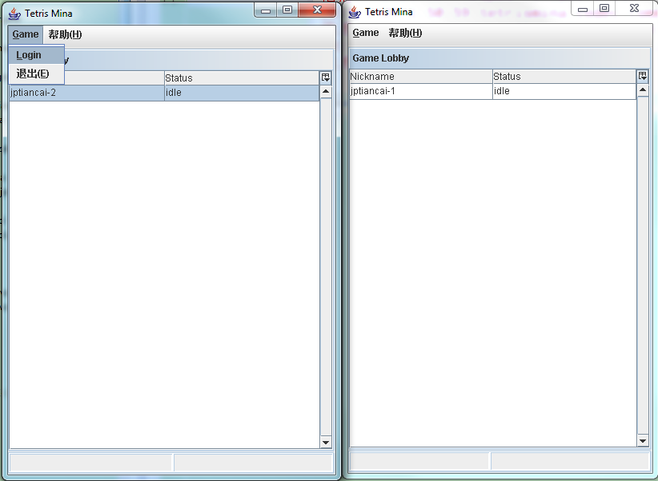
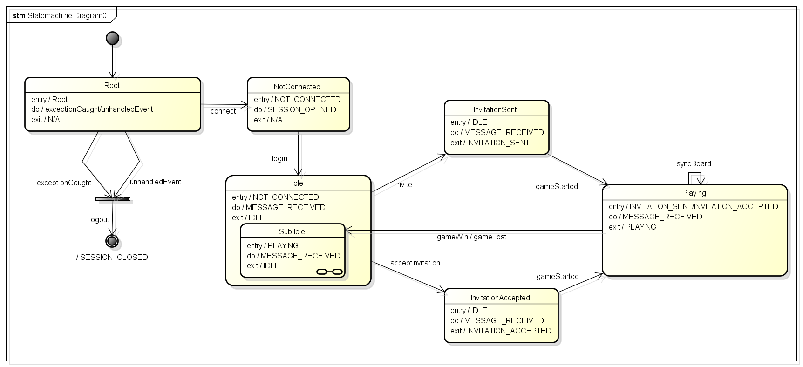

TetrisMina
==========

运行截图

- 登录游戏

- 游戏过程

TetrisMina分析

> MINA官方文档介绍非常详细,从`历史介绍`-->`框架鸟瞰`-->`核心概念`等关键部分都做了中重点标注和解释.堪称教科书式的文档说明.

**预备知识**

- [使用 Apache MINA 2 开发网络应用](https://www.ibm.com/developerworks/cn/java/j-lo-mina2/)
- [mina official documentation](https://mina.apache.org/mina-project/documentation.html#documentation)
- [Spring Richclient ~ A Journey](http://chrismdp.com/2006/04/spring-richclient/):看完这个系列之后,最好看一下它的实现[spring-rich-client](https://github.com/shevek/spring-rich-client)
- [传智播客-俄罗斯、贪吃蛇游戏－项目视频](http://java.itcast.cn/news/b4c1f433/34fd/4a7b/96bf/f1ae5e00ce70.shtml)

**背后原理**

I/O Peocessor,创建服务和协议--->I/O Filter,字节转换成数据结构或对象 --->I/O Handler,业务逻辑

**目录**
- [server端](#server)
- [State Machine](#State-Machine)
- [bug](#bug)

**server端**  [↑](#toc)

- ServerMain.java
	服务端入口类,调用TetrisServer的Start()函数
- TetrisServer.java
	- 自定义filter:TetrisCodecFactory类
	- (难点)自定义Handler:createIoHandler()函数调用mina自带的状态机StatMachine,创建AbstractStateContext,所谓的状态上下文

- ServerHandler.java
	真正的逻辑顺序:登陆(session中存入昵称,状态)-->刷新登陆列表,让所用用户都看到-->邀请对方--> 接收邀请--> 开启游戏--->结束游戏登出
	- (难点)采用Collections.synchronizedSet,采用HashSet而不是HashMap,@IoHandlerTransition注解

- PlayingGames.java
	开始游戏,找寻对手,结束游戏,用到StringUtils的isEmpty()函数

**State Machine**  [↑](#toc)

> 根据客户端的指令做出相应的状态调整.

状态名称| 描述
-------- | ---
Root| 其他5中状态的父状态;统一管理和处理异常;登出后的状态
NotConnected| session打开后状态
Idle| 用户登录后状态;游戏胜利;游戏结束
InvitationSent| 邀请其他对手游戏后的状态
InvitationAccepted| 接收其他对手游戏后的状态
Playing| 邀请和接收后的状态;同步其他对手的操作;

**bug**  [↑](#toc)

- [ ]  登录时,名字输入时可空,造成邀请对方时有问题
- [ ] 邀请是,点击否之后,再次邀请没有提示框了.
- [ ] 关闭时报错.
- [ ] 没有针对LoginCommand等指令的有效性做判断.参考[learn-mina-the-hard-way](https://github.com/jptiancai/learn-mina-the-hard-way)中`StateMachine`一节
- [ ] 增加空格控制键快速下落底部
- [ ] 单元测试

**设计模式**

- 抽象工厂模式,TetrisCommandFactory工厂通过反射`isAssignableFrom()函数`来创建AbstractTetrisCommand的11个子类.

**客户端**

- (难点,需要熟悉richclient编程)利用richclient的ApplicationLauncher函数通过配置来实例化窗口(菜单栏,按钮及文字等等).
- 进入游戏逻辑:刷新游戏列表-->接收邀请-->开始游戏-->同步广播-->赢得游戏

**domain**

- PlayerDataSource:用HashSet存储每个Player对象,并且防止了重复.

**游戏内实现**

**其他**

- `command.png`由[ObjectAid UML Explorer for Eclipse工具制作](http://www.objectaid.com/home)
- `Tetris Statemachine.png`由[Astah Professional工具制作](http://astah.net/editions/professional)

	
